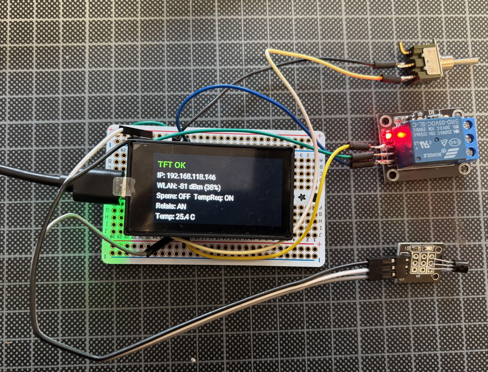

# ESP32-C6 TFT 1.91 – ESPHome
## Screenshot



ESPHome configuration for a Waveshare ESP32-C6 with 1.91" ST7789 TFT (170×320).

## Features
- ESP32-C6 (ESP-IDF)
- ST7789 display
- SPI interface
- Backlight via LEDC
- OTA + Home Assistant API

## Pinout

| Signal | GPIO |
|------|------|
| CS | GPIO7 |
| DC | GPIO6 |
| RST | GPIO14 |
| SCLK | GPIO5 |
| MOSI | GPIO4 |
| BL | GPIO15 |

## Usage

```bash
cp secrets.yaml.example secrets.yaml
esphome run esp32c6-tft191.yaml --device COMx
